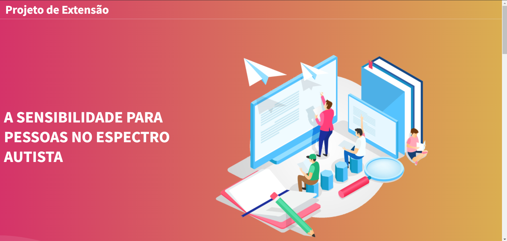
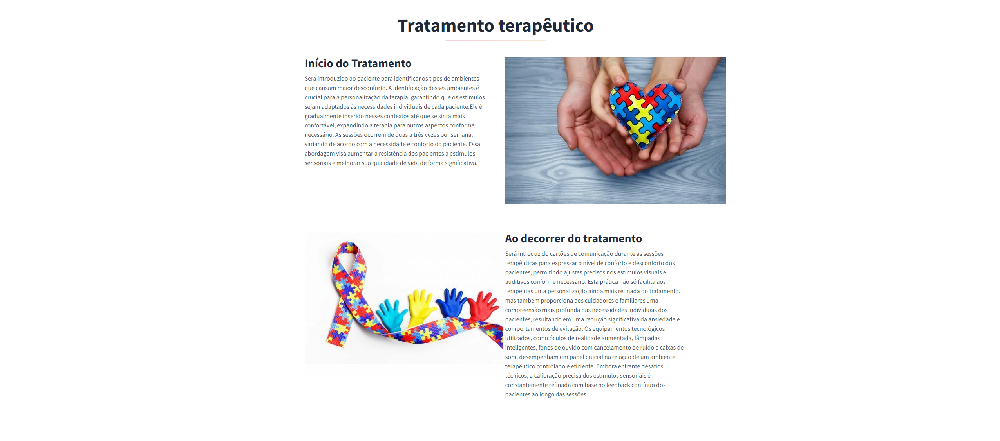
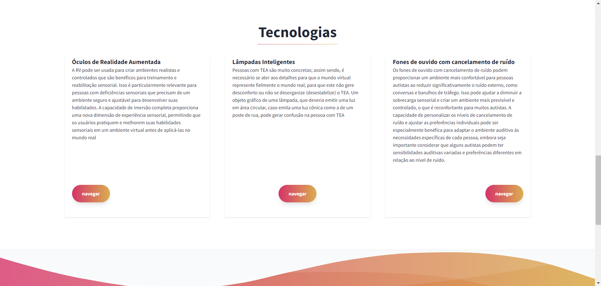
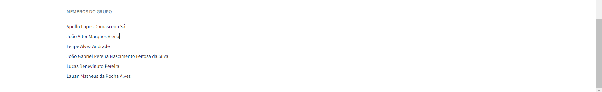

## Projeto de Extensão
O tema da aprensentação é "A SENSIBILIDADE PARA PESSOAS NO ESPECTRO AUTISTA"

## Primeiro tópido 
Explica como funcionará a parte prática sendo um Tratamento terapêutico. Deixando explícito o que acontecerá no início do tratamento e ao decorrer dele.

## Segundo tópico
Fala das tecnologias utilizadas e como eles dão suporte às pessoas com o espectro

## Terceiro tópico
É a parte "Acesse o Nosso artigo" onde você encontra um botão de âncora para ter acesso ao artigo desenvolvido

## Quarto tópico
A parte final do site onde tem o nome de cada membro e quando passa o mouse em cima o leva para o instagram do membro em questão
